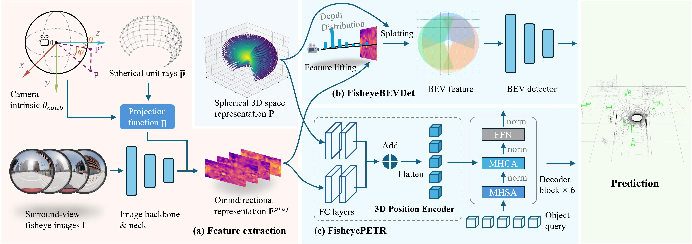
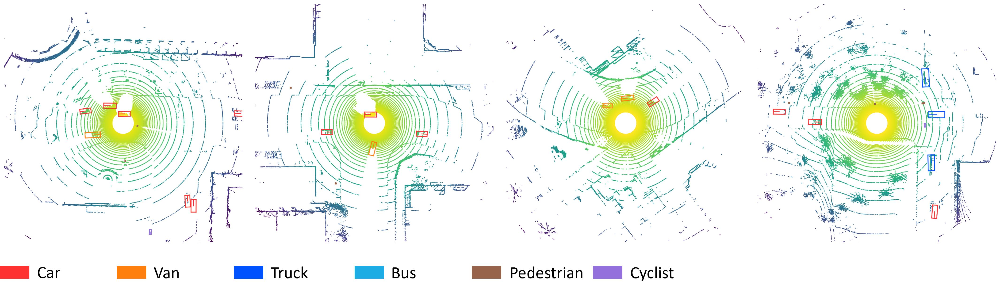

# Exploring Surround-View Fisheye Camera 3D Object Detection

Official implementation of ["Exploring Surround-View Fisheye Camera 3D Object Detection"](https://arxiv.org/abs/2511.18695) (AAAI 2026)




## 🚀 Getting Started

### 🛠️ Installation

**Important**: Do **not** install MMDetection3D via `pip install mmdet3d` or `mim install mmdet3d`.  
Our code is implemented as a **project plugin** and must be placed inside the MMDetection3D source tree (in the `projects/` folder).


**Recommended steps**:
1. Clone and install MMDetection3D **v1.4.0** from source following the [official installation guide](https://mmdetection3d.readthedocs.io/en/latest/get_started.html).  
   (Use `git clone --branch v1.4.0 https://github.com/open-mmlab/mmdetection3d.git` and then `pip install -v -e .`)

2. Clone this repository into the `projects/` directory of MMDetection3D:
   ```bash
   cd mmdetection3d/projects
   git clone https://github.com/weiyangdaren/Fisheye3DOD.git
    ```
    
3. Install our plugin in editable mode after cloning this repo into `mmdetection3d/projects/`, **stay in your conda environment** and run:
    ```bash
    # Make sure you are at the root of MMDetection3D
    cd path/to/mmdetection3d   # <-- important: must be the folder that contains `mmdet3d/` and `projects/`

    # Install our plugin (editable mode is required)
    pip install -e projects/Fisheye3DOD
    ```
    
4. Install the fisheye undistortion library (ocamcalib_undistort)
   ```bash
   pip install git+https://github.com/matsuren/ocamcalib_undistort.git
   ```

### 🗃️ Data Preparation
1. Download the Fisheye3DOD dataset from [Baidu Netdisk (pwd: 3uwg)](https://pan.baidu.com/s/1pfM-NdKCjrOGwsKMu9xpEw?pwd=3uwg) and extract all files into `data/Fisheye3DODdataset/` under your MMDetection3D root directory.

2. **Important**: Copy or move the `ImageSets-2hz` folder from **this repository** into the dataset directory:
   ```bash
   cp -r projects/Fisheye3DOD/ImageSets-2hz /path/to/mmdetection3d/data/Fisheye3DODdataset/
   # or simply drag it with your file manager
   ```
   Final path must be:
   ```bash
   data/Fisheye3DODdataset/ImageSets-2hz/
                            ├── train.json
                            └── val.json
   ```

3. Generate MMDetection3D-compatible info files:

    ```bash
    python projects/Fisheye3DOD/tools/fisheye3dod_converter.py
    ```
    This will create `fisheye3dod_infos_train.pkl` and `fisheye3dod_infos_val.pkl` inside `ImageSets-2hz/`.

### ⌛ Model Training & Evaluation

1. **🏋️ Model Training**

    Execute the following command to start training with our fisheye-optimized configuration:

    ```bash
    cd /path/to/your/mmdetection3d  # Replace with actual installation path

    python tools/train.py \
    projects/Fisheye3DOD/configs/fisheye_bevdet.py
    ```

    Training logs and model weights will be automatically saved in the `work_dirs` directory.

2. **📊 Model Evaluation**

    For immediate evaluation, download our pre-trained checkpoints from [**here**](https://pan.baidu.com/s/1IxF416KhA6VXGFV3fUYPlg?pwd=8daz) and run:

    ```bash
    python tools/test.py projects/Fisheye3DOD/configs/fisheye_bevdet.py \
    /path/to/your/checkpoint.pth   # Checkpoint path (e.g. ckpts/fisheye_bevdet.pth)
    ```

### 📺 Detection Results Visualization
After inference completion, the output files (`epoch_x.pkl`) will be stored in:  
`work_dirs/fisheye_bevdet/[timestamp]/save_detection/`

To visualize detection results, run:
```bash
python projects/Fisheye3DOD/tools/fisheye3dod_visualizer.py \
    --root /path/to/your/dataset \          # Dataset root path (e.g. ./data/Fisheye3DODdataset) \
    --pickle_path /path/to/your/output.pkl  # Detection results (e.g. work_dirs/.../epoch_20.pkl)
```
This script generates visualization of detection results from the LiDAR coordinate perspective.
An example output is shown below:



## 🙏 Acknowledgment  
This work is built upon open-source 3D perception frameworks including [mmdetection3D](https://github.com/open-mmlab/mmdetection3d), [LSS](https://github.com/nv-tlabs/lift-splat-shoot), [BEVDet](https://github.com/HuangJunJie2017/BEVDet), [BEVFusion](https://github.com/open-mmlab/mmdetection3d/tree/main/projects/BEVFusion) and [PETR](https://github.com/open-mmlab/mmdetection3d/tree/main/projects/PETR), with fisheye calibration implemented using [ocamcalib_undistort](https://github.com/matsuren/ocamcalib_undistort). 

The Fisheye3DOD dataset collection leverages the [CARLA](https://github.com/carla-simulator/carla) simulator, while referencing data annotation protocols from [nuScenes](https://github.com/nutonomy/nuscenes-devkit) and [Lyft](https://github.com/lyft/nuscenes-devkit). 

We gratefully acknowledge these foundational contributions.


